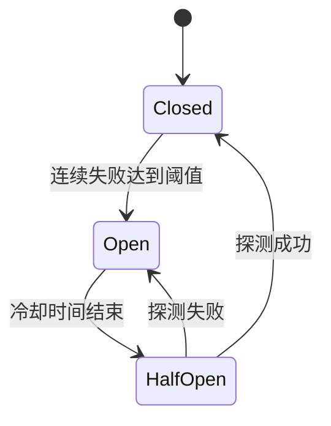

# Local Model Router 代码审阅学习计划

## 1. 学习目标

本计划不以“逐行读完所有代码”为目标，而是把项目转化为可解释、可修改、可验证的个人工程能力。

每个主题都需要完成以下闭环：

1. 说明它解决的具体问题。
2. 画出主要调用链或状态变化。
3. 识别边界条件并预测行为。
4. 使用现有测试或新增实验验证预测。
5. 独立完成一次小修改或故障排查。
6. 不看代码，用两分钟说明问题、设计、边界、验证方法和遗留风险。

## 2. 当前基线

2026-08-11 已执行：

```powershell
npm run check
npm test
```

语法检查和全部快速测试通过。Electron 真机生命周期、安装包和自动更新链路不包含在这次基线验证中，需要在后续阶段单独执行。

## 3. 推荐学习顺序

### 阶段一：通过测试建立行为地图

**阅读入口**

- [`test/fallback-smoke.test.js`](../test/fallback-smoke.test.js)
- [`README.md`](../README.md)

**目标**

暂时不深入实现，先把测试视为可执行的行为规格，归纳 Router 对成功、失败、超时、流式响应和配置变化的处理规则。

**需要回答的问题**

- 哪些 HTTP 状态码会触发故障转移？
- 为什么 `400`、`401`、`403`、`404` 默认不触发故障转移？
- 等待响应头超时和流式响应持续时间有什么区别？
- 客户端断开后，Router 和上游请求分别如何结束？
- 为什么部分响应已经发送后不能切换供应商？
- 无效配置热加载为什么不能破坏最后一份有效配置？

**练习产物**

整理一张行为决策表，至少包含以下场景：

| 场景 | 是否回退 | 是否计入熔断 | 是否允许切换供应商 |
| --- | --- | --- | --- |
| 上游返回 `429` | 待读码确认 | 待读码确认 | 待读码确认 |
| 上游返回 `401` | 待读码确认 | 待读码确认 | 待读码确认 |
| 等待响应头超时 | 待读码确认 | 待读码确认 | 待读码确认 |
| 已向客户端输出部分内容 | 待读码确认 | 待读码确认 | 待读码确认 |
| 客户端主动断开 | 待读码确认 | 待读码确认 | 待读码确认 |

先独立预测，再根据测试断言修正，不要直接抄写 README 结论。

**完成标准**

- 能从测试名称和断言反推出主要产品规则。
- 能解释至少三个“不能回退”的场景及原因。
- 能指出已有测试没有覆盖的两个边界条件。

### 阶段二：理解 Router 核心请求链

**阅读入口**

- [`src/server.js`](../src/server.js)
- [`src/runtime-config.js`](../src/runtime-config.js)
- [`test/fallback-smoke.test.js`](../test/fallback-smoke.test.js)

**目标**

跟踪一条请求从进入本地 Router 到返回客户端的完整路径：

```text
鉴权
  -> 解析并限制请求体
  -> 按模型筛选供应商
  -> 向熔断器申请执行权限
  -> 转换请求协议
  -> 调用上游
  -> 判断成功、回退或终止
  -> 转换或流式转发响应
```

**需要回答的问题**

- 本地 API Key 在哪里校验，健康检查是否存在不同鉴权路径？
- 请求体大小限制如何避免无界内存占用？
- 供应商筛选为什么以请求模型为条件？
- 超时为什么主要限制连接和等待响应头，而不是限制整个响应流？
- 客户端取消是如何传递到上游请求的？
- 响应头和响应体分别在哪个时刻提交给客户端？
- 哪些故障属于供应商问题，哪些属于客户端请求或配置问题？

**实践任务**

1. 为 `handleGeneration` 画流程图，标记所有返回点和异常分支。
2. 为每个供应商尝试记录“开始、响应头到达、回退、流开始、流结束”五个关键时刻。
3. 选择一个尚未覆盖的边界条件，先编写故障注入思路，再运行最窄验证。

**完成标准**

- 能不看代码讲清一次成功请求和一次回退请求。
- 能解释“流所有权”以及流开始后禁止回退的原因。
- 能定位超时、客户端断连和上游错误分别由哪段代码处理。

### 阶段三：掌握供应商熔断状态机

**阅读入口**

- [`src/vendor-circuit-breaker.js`](../src/vendor-circuit-breaker.js)
- [`test/vendor-circuit-breaker.test.js`](../test/vendor-circuit-breaker.test.js)

**目标**

理解 Closed、Open、Half-open 三种状态，以及失败阈值、单探针恢复和线性退避。



**需要回答的问题**

- 为什么状态按“供应商 + 模型”隔离？
- 为什么 Half-open 阶段只允许一个探针请求？
- 连续失败次数和弹出次数分别表示什么？
- 为什么重复探测失败会逐步增加冷却时间？
- 所有匹配供应商都处于 Open 状态时，为什么仍要强制探测最早到期者？
- 配置热加载后重建熔断器是否符合预期产品语义？

**实践任务**

1. 手工推演同一供应商、两个模型的状态变化。
2. 推演两个并发请求同时进入 Half-open 阶段的结果。
3. 使用测试中的可控时钟验证冷却时间和恢复优先级。

**完成标准**

- 能独立画出状态机并解释每条转换边。
- 能说明熔断器与普通重试机制的区别。
- 能指出至少一个状态键设计或热加载语义方面的潜在风险。

### 阶段四：学习配置一致性与热加载

**阅读入口**

- [`gui/electron/config-store.js`](../gui/electron/config-store.js)
- [`src/config.js`](../src/config.js)
- [`src/runtime-config.js`](../src/runtime-config.js)
- [`src/server.js`](../src/server.js)
- [`test/config-and-urls.test.js`](../test/config-and-urls.test.js)
- [`test/electron-lifecycle.test.js`](../test/electron-lifecycle.test.js)

**目标**

理解配置从 Renderer 表单保存到磁盘，再应用到运行中 Router 的完整一致性链路。

**核心机制**

- SHA-256 revision：检测基于旧快照的保存请求。
- 写入队列：串行化当前 Electron 主进程内的配置写入。
- 规范化和校验：写入前建立稳定的数据形态和约束。
- 同目录临时文件：保证临时文件与目标文件位于同一文件系统。
- 排他创建：避免意外覆盖现有临时文件。
- `sync` 后 `rename`：降低写入中断产生半份配置的风险。
- 配置快照：新请求使用新配置，进行中的请求继续使用原快照。
- 重启字段分流：`host`、`port`、`logFile` 保留旧运行值并提示重启。

**重点审计问题**

- 如果临时文件写入或 `sync` 失败，临时文件是否会被清理？
- revision 检查后、rename 前发生外部修改时，是否仍可能覆盖新配置？
- `writeQueue` 能防止哪些竞争，不能防止哪些竞争？
- 原子 rename 是否等价于断电后一定持久化？目录是否需要同步？
- 手工写入无效 JSON 时，运行中的 Router 如何保留最后有效配置？
- 热加载时重建熔断器会不会过早恢复故障供应商？

**实践任务**

1. 画出“加载配置 -> 编辑 -> 保存 -> revision 校验 -> 原子替换 -> Router 重载”的时序图。
2. 设计写入失败、旧 revision、外部并发修改和无效 JSON 四类实验。
3. 选择一个经验证的问题完成最小修复，并补充针对性测试。

**完成标准**

- 能区分进程内串行化、乐观并发控制和文件系统原子性。
- 能解释哪些配置可热加载，哪些必须重启。
- 能以测试证明一个边界问题存在或不存在。

### 阶段五：理解 OpenAI 双协议适配

**阅读入口**

- [`src/openai-protocol.js`](../src/openai-protocol.js)
- [`test/openai-protocol.test.js`](../test/openai-protocol.test.js)
- [`src/server.js`](../src/server.js)

**目标**

理解 Chat Completions 与 Responses 之间的请求、响应转换边界，并区分无损透传、有限转换和必须拒绝的场景。

**需要回答的问题**

- 客户端格式与供应商格式相同时，为什么优先原样转发？
- 文本消息、系统指令、图像输入和工具调用如何映射？
- 哪些格式专属参数无法安全转换？
- 为什么跨协议流式转换应返回错误，而不是静默丢字段？
- 响应转换是否会遗漏多 choice、复杂工具调用或其他输出项？
- 未识别字段应该透传、丢弃还是拒绝？判断依据是什么？

**实践任务**

1. 建立 Chat Completions / Responses 字段兼容矩阵。
2. 每种字段标记为“无损转换”“有损转换”“不支持”。
3. 选择一个真实供应商样例，验证工具调用和错误响应的实际形态。

**完成标准**

- 能解释协议适配层为什么不能只做字段重命名。
- 能指出至少三个必须显式拒绝而不能静默转换的场景。
- 能从测试定位文本、工具调用和多模态转换的证据。

### 阶段六：理解 Electron 控制面与进程生命周期

**阅读入口**

- [`gui/electron/main.js`](../gui/electron/main.js)
- [`gui/electron/preload.cjs`](../gui/electron/preload.cjs)
- [`gui/electron/ipc-contracts.js`](../gui/electron/ipc-contracts.js)
- [`test/ipc-contracts.test.js`](../test/ipc-contracts.test.js)
- [`test/electron-lifecycle.test.js`](../test/electron-lifecycle.test.js)

**目标**

理解 React Renderer、Electron 主进程和 Router 子进程之间的职责边界，以及启动、托盘驻留、异常恢复和退出流程。

**需要回答的问题**

- Router 由谁创建、监控和停止？
- 如何结合 PID、实例 ID 和健康检查确认目标进程身份？
- 关闭窗口、隐藏到托盘、显式退出分别触发什么行为？
- 为什么 Renderer 不直接访问 Node.js API？
- Preload 暴露了哪些最小能力？
- IPC 请求和返回值为什么都需要 schema 校验？
- 优雅退出失败时，何时允许强制终止子进程？

**实践任务**

1. 画出 Renderer、Main、Router、文件系统和上游供应商之间的架构图。
2. 画出 Router 启动和显式退出时序图。
3. 运行 Electron 生命周期测试：

```powershell
npm run test:electron
```

4. 分别模拟端口占用、旧 PID 元数据、Router 崩溃和窗口关闭。

**完成标准**

- 能解释三个进程边界及各自职责。
- 能说明实例身份校验比单独检查 PID 更可靠的原因。
- 能通过测试验证“关窗驻留”和“显式退出停止 Router”。

## 4. 后续专题

完成六个核心阶段后，再按优先级审阅以下内容：

1. [`src/logger.js`](../src/logger.js)：递归敏感信息脱敏和结构化日志。
2. [`gui/electron/log-store.js`](../gui/electron/log-store.js)：基于字节游标的日志分页和文件增长处理。
3. [`gui/electron/updater.js`](../gui/electron/updater.js)：自动更新状态机、失败恢复和发布元数据。
4. [`gui/src/config-draft.js`](../gui/src/config-draft.js)：持久化配置与表单状态之间的无损转换。
5. [`.github/workflows`](../.github/workflows)：Windows/macOS CI、打包、签名、公证和 GitHub Releases。

## 5. 单次 Review 模板

每次只审阅一个主题，建议控制在 60–90 分钟。

```markdown
## 主题

### 要解决的问题

### 我的行为预测

### 主要调用链或状态机

### 已有测试证据

### 尚未覆盖的边界条件

### 缺陷或风险假设

### 验证方法与结果

### 本次独立修改

### 两分钟口述总结
```

推荐工作方式：

1. 先根据 README 和测试预测行为。
2. 沿一个入口追到直接控制行为的代码。
3. 画调用链或状态图。
4. 提出一个可被测试证伪的风险假设。
5. 做最小修改或故障注入。
6. 先运行最窄测试，再运行完整快速测试。
7. 最后让 AI 根据代码和测试追问，而不是直接让 AI 代替总结。

## 6. 推荐的独立改进方向

完成前述学习后，从以下方向选择一项形成个人改进证据：

1. 配置写入失败时的临时文件清理与并发写入测试。
2. Chat Completions / Responses 协议兼容矩阵及契约测试。
3. 跨协议成功响应大小限制和慢流资源占用保护。
4. 结构化日志轮转与磁盘上限。
5. 故障转移延迟、并发连接和长流资源消耗基准。
6. Router 崩溃、多实例竞争和异常退出恢复测试。

选择标准：问题必须能复现，修改必须能解释，结果必须能通过自动化测试或可重复实验验证。

## 7. 简历升级门槛

当前稳妥表述：

> 面向 Copilot BYOK 同模型多供应商配置冲突，设计并验证本地 OpenAI 兼容路由方案，定义供应商优先级、超时及状态码故障转移规则。

在满足以下条件前，不表述为“独立实现生产级路由器”“高可用架构”，也不填写未经测量的性能或可用性数据：

1. 不看代码讲清 Router、熔断器、协议适配、配置热加载和 Electron 生命周期。
2. 独立完成至少一项实质改进，并保留测试和 Git 提交证据。
3. 建立可复核指标，例如故障场景覆盖数、回退延迟、并发连接数、长流稳定时长和资源占用。
4. 能现场定位一个一般故障并完成小范围修改。

达到门槛后，可根据实际证据升级为以下结构，方括号内容必须由测量结果替换：

> 设计并实现本地 OpenAI 兼容模型路由器，支持 Chat Completions / Responses 协议适配、多供应商故障转移及按供应商和模型隔离的熔断恢复；独立完成 `[具体改进]`，通过 `[测试或基准]` 验证 `[可复核结果]`。

## 8. 建议执行节奏

| 周次 | 内容 | 主要产物 |
| --- | --- | --- |
| 第 1 周 | 阶段一、二 | 行为决策表、Router 请求流程图 |
| 第 2 周 | 阶段三、四 | 熔断状态图、配置热加载时序图、一个已验证风险假设 |
| 第 3 周 | 阶段五、六 | 协议兼容矩阵、Electron 架构图与生命周期验证记录 |
| 第 4 周 | 独立改进 | 代码修改、测试、基准或故障复现记录、两分钟项目讲稿 |

时间不足时，优先完成阶段一至五。它们与 AI 应用开发岗位的模型接入、流式服务、容错和协议理解更直接相关；Electron 和发布链路作为工程化补充。